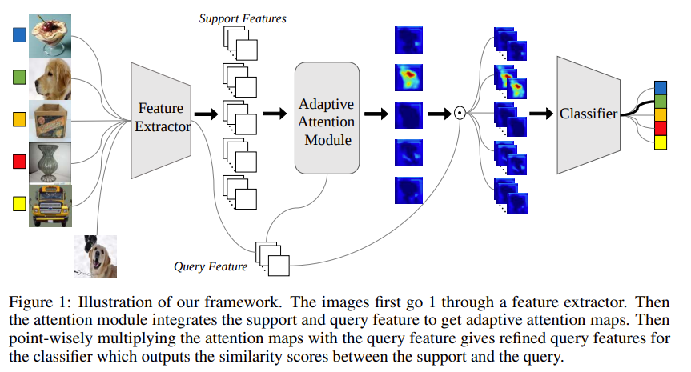
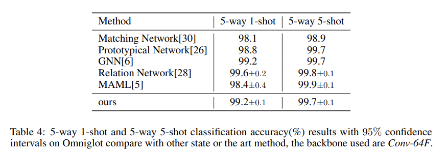
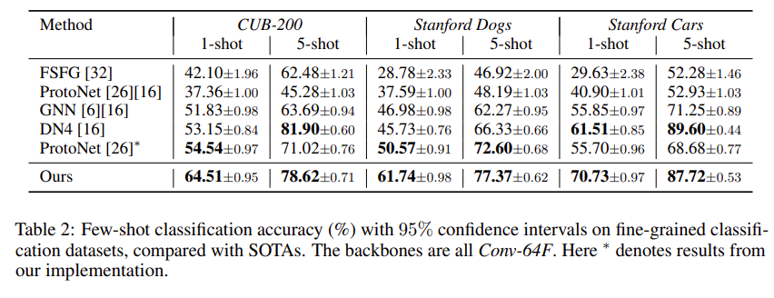
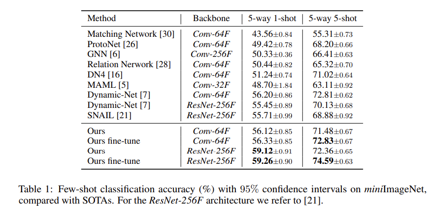
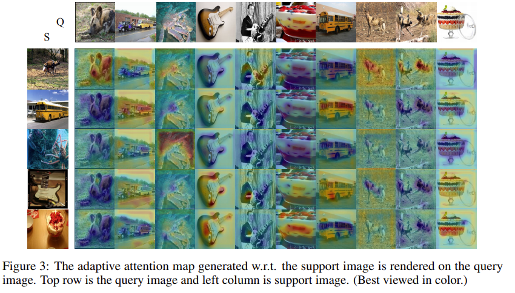

# Adaptive-Attention
Code for paper [Few-shot Classification via Adaptive Attention](https://arxiv.org/abs/2008.02465)

To process and get the mini-ImageNet dataset, please refer to this [repo](https://github.com/yaoyao-liu/mini-imagenet-tools).

### Pipeline


### 

### Result









### Usage
pytorch 0.4.0 is required


For Omniglot:

Directly run  `bash train.sh omni`.

For mini-ImageNet and others:

Once you get the dataset (take mini-ImageNet for example), please use src/mini_imagenet_dataset.py to split the dataset. The processed dataset will be placed in /dataset/MiniImageNet by default. Then you can run `bash train.sh Mini` to train a Conv-64F model in 5 way 1 shot setting.

For more options, please refer to the code.

### Note
This work is done in Summer, 2019. We admit that the problem setting is quite far away from real scenario. We may pick up the idea in the future if better problem setting for few-shot learning are proposed.  

### Citation
If you find this repo helpful for your research, you can consider cite 

```bibtex
@article{jiang2020few,
  title={Few-shot Classification via Adaptive Attention},
  author={Jiang, Zihang and Kang, Bingyi and Zhou, Kuangqi and Feng, Jiashi},
  journal={arXiv preprint arXiv:2008.02465},
  year={2020}
}
```
